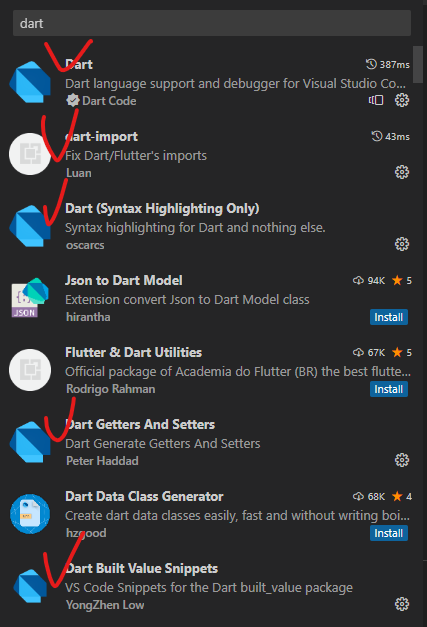
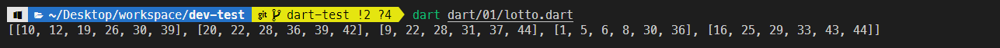
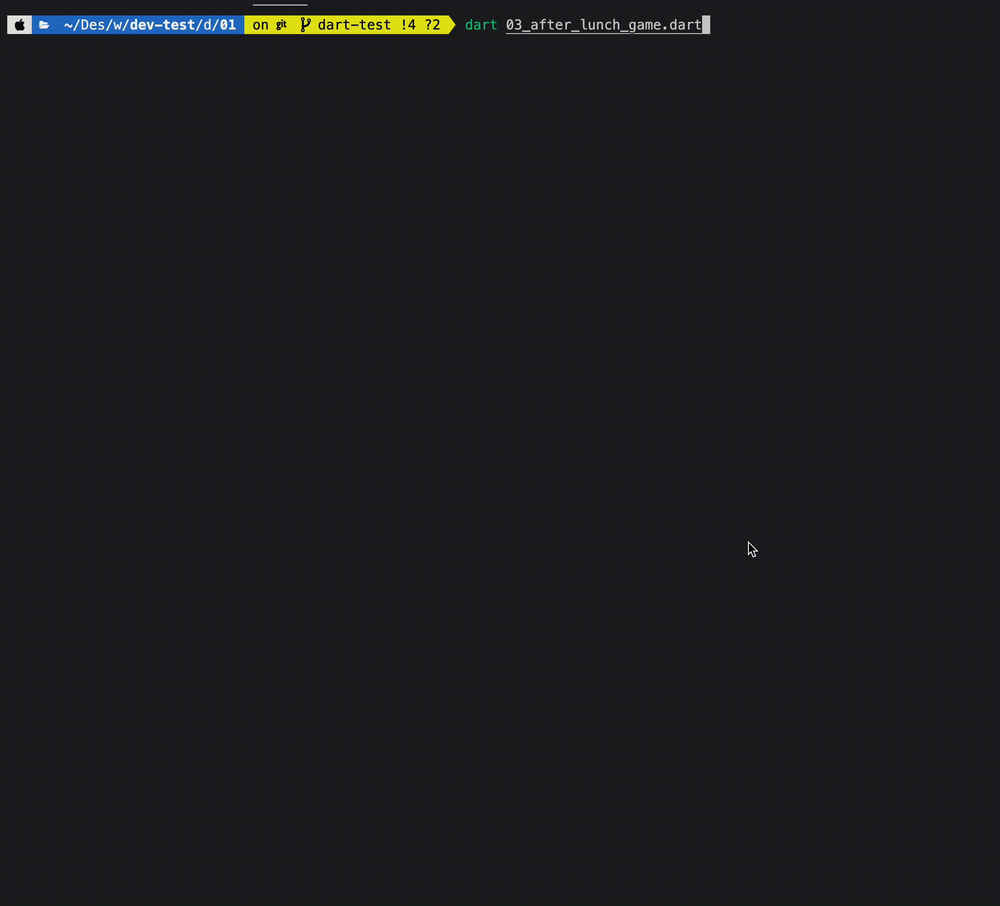

# 시험 환경 만들기

- mokokos 회원들

  1.  프로젝트 경로로 이동
  2.  `$ git checkout 본인이름` (자기 브랜치로 이동)
  3.  `$ git pull origin dart-test` (dart-test의 브랜치의 내용을 pull 받음)
  4.  dart 폴더 생성되었는지 확인
  5.  01 폴더의 dart 파일 내부를 작성해 문제 해결
  6.  완성 한 후 add => commit => push

- mokokos 비회원들
  [다운로드](./01.zip)
  - 위 파일을 다운로드한 후 문제를 풉니다.
  - 완료한 이후에 다시 압축하여 슬랙으로 보냅니다.

# Dart 환경 설정하기

## mac

- dart SDK 공식 문서
  ```
  $ brew install dart-lang/dart
  $ brew install dart
  ```
- vscode에서 dart 실행 방법
  `$ dart 파일이름.dart`

# VScode Extension 설치하기



## 문제 1. 출력 (10점)

`안녕하세요. 저는 XX입니다. 반갑습니다.`라는 문구에 본인의 이름을 넣어 출력해보세요.


## 문제 2. 입력 (20점)

> dart 내장 라이브러리 사용해보기<br/>
> 터미널로부터 입력 받기 (힌트 키워드 : dart:io, stdin)

프로그램을 시작하면,
`당신은 누구입니까?` 라는 문구가 터미널에 표시되고, 사용자의 입력을 받을 수 있게끔 구현해보세요.

입력을 완료하면,
`안녕하세요. 저는 XX입니다. 반갑습니다.` XX 자리에 입력한 이름이 보일 수 있도록 구현해주세요.


## 문제 3. 로또 번호 생성 프로그램 만들기 (40점)

> dart 내장 라이브러리 사용해보기<br/>
> 랜덤 (힌트 키워드 : dart:math, Random)

**힌트 키워드**

> 반복문, 조건문, List

여러 분은 로또 다섯 게임의 번호를 랜덤으로 생성하는 dart 프로그램을 만들어야합니다.
로또는 한 게임 당, 1부터 45번 까지의 번호 중 중복되지 않은 6개를 선택합니다. `ex) 42, 6, 15, 33, 3, 44`

1. 랜덤으로 6개의 숫자를 생성해 한 게임을 만듭니다.
   `[42, 6, 15, 33, 3, 44]`

2. 6개 숫자를 정렬하여 배치합니다.
   `[3, 6, 15, 33, 42, 44]`

3. 이렇게 만든 게임들을 다시 모아 5개의 게임을 만들어 출력합니다.
   ```
   [
       [16, 18, 28, 31, 42, 45],
       [4, 13, 14, 19, 30, 39],
       [7, 22, 24, 33, 40, 43],
       [2, 18, 21, 25, 40, 45],
       [10, 13, 17, 23, 42, 43]
   ]
   ```
   
   오늘 나온 번호로 로또를 구매하면 +1점..ㅋㅋㅋ

## 문제 4. 식사 후 치우기 게임 (50점)

> dart 내장 라이브러리 사용해보기
> 랜덤 (힌트 키워드 : dart:math, Random)
> 딜레이 (힌트 키워드 : dart:io, sleep)

**힌트 키워드**

> 반복문, 조건문, List, List method

dart로 식사 후 치우기 당번을 선정하는 게임을 만들어 보세요.

1. 참여한 사용자를 터미널로부터 입력받습니다.
   `함께 식사를 한 사람을 입력해주세요. (종료: Q)`라는 문구가 출력되고 사용자의 입력을 각각 한 명씩 받습니다.

2. `Q`를 입력하면 입력이 종료되고, 당번을 뽑습니다.

3. `두구두구두구...`가 출력되며 사람들 중 한 명씩 **랜덤**으로 빠지면서 당번이 아닌 사람을 출력해줍니다.<br/>
   `judy 아니쥬!?`<br/>

   각 출력엔 1초의 딜레이를 넣어주세요.

4. 빠지지 못한 사람을 당번으로 정해줍니다.
   `Jake 당첨!`

- 아래 이미지에서 dart 실행 명령은 `dart 04_after_lunch_game.dart`입니다.
  

## 문제 5. 토끼는 모두 몇 쌍? (100점)

```
처음에는 새로 태어난 토끼 한 쌍만이 존재한다.
두 달 이상이 된 토끼는 번식 가능하다.
번식 가능한 토끼 한 쌍은 매달 암수 토끼 한 쌍을 낳는다.
토끼는 죽지 않는다.
일 년 뒤 토끼는 모두 몇 쌍이 될까?

- <산반서> 3부 중
```

**힌트 키워드**

> 없음

현재 (0개월), 새로 태어난 토끼 한 쌍(A)이 존재한다고 가정합니다.<br/>
여러분은 몇 개월 뒤에 몇 쌍의 토끼가 존재하는 지 알아내는 프로그램을 만들어야 합니다.<br/>
1개월 뒤에는 아직 새로 태어난 토끼 한 쌍(A)이 번식 불가능하므로, 한 쌍의 토끼만이 존재합니다.<br/>
2개월 뒤에는 기존의 토끼 한 쌍(A)이 번식으로 했으므로 또 새로운 토끼 한 쌍(B)가 태어나 2쌍의 토끼가 존재합니다.<br/>
3개월 뒤에는 A는 번식이 가능하지만, B는 번식이 불가능 하므로 또 새로운 토끼 한 쌍(C)가 태어나 세 쌍의 토끼가 존재합니다.<br/>
4개월 뒤에는 A, B는 번식이 가능하지만 C는 번식이 불가능하므로 두 쌍이 태어나 5쌍의 토끼가 존재합니다.<br/>

프로그램을 시작하면,
`몇 개월 째 토끼가 몇 쌍인지 구할까요?` 라는 문구가 터미널에 표시되고, 사용자의 입력을 받을 수 있게끔 구현해보세요.<br/>
이후, 토끼가 몇 쌍인지 출력하는 프로그램을 만들어주세요.


